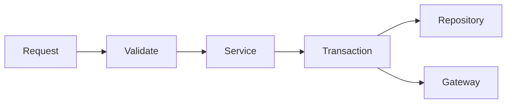

Build an initial open-source implementation of **Converge** from the specification below.

Treat this document as the source of truth for the product direction.

Prioritise a **working vertical slice** over broad completeness.

Do not expand Converge into a general-purpose coding agent, specification framework, Pull Request review system, custom editor, or custom language server.

Keep the **core IDE-independent** and use **VS Code as the first client**.

Where implementation details are unspecified, choose the simplest reversible approach and record significant technical decisions.

Implement incrementally, with tests.

The first complete vertical slice should prove this workflow:

```text
task/specification
    ↓
agent investigates
    ↓
agent proposes meaningful Change Unit
    ↓
Converge shows concise rationale
    ↓
optional visualisation
    ↓
human inspects / discusses / redirects / approves
    ↓
agent applies approved change
    ↓
VS Code diff can be inspected
    ↓
tests / verification run
    ↓
next Change Unit
    ↓
implementation completes
    ↓
final shared-understanding check
```

The goal is to demonstrate the interaction model, not to build every future feature.

---

# Converge

## Working title

**Converge**

Converge is an open-source developer tool for AI-assisted software implementation.

Its purpose is to reduce the cognitive overload created when AI coding agents can generate and modify code substantially faster than a human engineer can meaningfully understand it.

Converge is not primarily a code-generation tool, a code-review tool, a specification framework, or an autonomous coding agent.

It is an **interactive pair-programming and comprehension harness** that sits between an implementation specification and final code review.

The central principle is:

> **AI should not increase implementation velocity faster than the engineer can maintain an accurate mental model of the software being produced.**

Converge should allow an AI agent to investigate, propose, implement, test and refactor code while continuously communicating the meaning of that work to the engineer in small, understandable units.

The engineer remains responsible for technical direction.

The AI may perform implementation work, but meaningful engineering decisions must be explicit enough that the engineer can understand, challenge, redirect or approve them.

The desired end state is not merely:

> The agent finished.

The desired end state is:

> **The implementation is correct, the agreed specification is satisfied, the tests pass, and the engineer understands the resulting solution.**

---

# 1. Problem

Modern coding agents can generate extremely large code changes.

A feature request may result in:

* dozens of changed files;
* thousands of lines of code;
* new abstractions;
* changed control flow;
* altered persistence behaviour;
* new dependencies;
* modified error handling;
* new tests;
* significant architectural decisions.

The conventional workflow is usually:

```text
request
  ↓
agent works
  ↓
large accumulated diff
  ↓
human attempts to understand it
```

This creates a fundamental asymmetry.

The AI created the implementation incrementally and had context about why decisions were being made.

The engineer sees the accumulated result and has to reconstruct that reasoning backwards from the code.

The human effectively performs:

```text
CODE
  ↓
infer intent
  ↓
infer design decisions
  ↓
infer architecture
  ↓
infer behaviour
  ↓
infer failure semantics
  ↓
infer why abstractions exist
  ↓
infer how the system fits together
```

As agent capability increases, this becomes increasingly unrealistic.

A 5,000-line change can be correct and still exceed a reasonable human comprehension budget.

This creates **comprehension debt**.

The codebase advances faster than the engineer's understanding of the codebase.

Converge exists to prevent that.

Implementation should instead progress as:

```text
INTENT
   ↓
RATIONALE
   ↓
VISUAL EXPLANATION WHEN USEFUL
   ↓
PROPOSED CHANGE
   ↓
HUMAN UNDERSTANDING
   ↓
DISCUSS / REDIRECT / APPROVE
   ↓
IMPLEMENT
   ↓
VERIFY
   ↓
NEXT CHANGE
```

The engineer should accumulate understanding at roughly the same time that the system accumulates implementation.

---

# 2. Converge is not Pull Request review

Converge must not replace normal Pull Request review.

These are separate activities.

During Converge:

> Why are we making this change, and do we agree with the implementation direction?

During Pull Request review:

> Is the complete resulting solution correct, maintainable and suitable to merge?

Converge occurs **during implementation**.

PR review occurs **after implementation**.

Do not attempt to replace:

* Pull Requests;
* peer review;
* code-owner review;
* CI;
* security scanning;
* static analysis;
* architecture review;
* repository governance.

The objective is to improve the state of the implementation before those processes begin.

---

# 3. Converge is not primarily an approval system

Approval is a mechanism.

Comprehension is the objective.

Traditional agent permissions ask:

> May the AI modify this file?

Converge asks:

> Do you understand why this implementation decision is being proposed, and do you agree with it?

Approval therefore operates primarily at the level of a **meaningful engineering decision**, not every filesystem mutation.

Do not require approval for every trivial edit.

Examples that usually should not need their own Change Unit:

* formatting;
* imports;
* trivial renames;
* mechanical changes caused directly by an already-approved decision;
* straightforward compiler fixes.

Examples that normally should:

* introducing an abstraction;
* changing component responsibility;
* changing public behaviour;
* changing an API;
* altering persistence semantics;
* changing concurrency;
* introducing retries;
* modifying failure handling;
* changing transaction boundaries;
* changing state transitions;
* adding caching;
* adding a significant dependency;
* altering authentication or authorization;
* changing data flow;
* changing recovery behaviour;
* selecting a consequential algorithm;
* changing an architectural seam.

The unit should be semantic, not line-based.

---

# 4. Change Units

Model implementation through structured **Change Units**.

A Change Unit represents one meaningful implementation decision.

Illustrative model:

```typescript
interface ChangeUnit {
  id: string;

  title: string;

  intent: string;

  rationale: string;

  affectedFiles?: FileReference[];

  estimatedScope?: {
    files?: number;
    lines?: number;
  };

  behaviouralImpact?: string;

  architecturalImpact?: string;

  risks?: string[];

  evidence?: Evidence[];

  visualisations?: Visualisation[];

  tests?: TestEvidence[];

  dependsOn?: string[];

  supersedes?: string;

  humanFeedback?: Feedback[];

  status:
    | "proposed"
    | "discussing"
    | "redirected"
    | "revising"
    | "approved"
    | "implementing"
    | "implemented"
    | "verified"
    | "rejected";
}
```

This schema is not mandatory verbatim.

The important principle is:

> **A meaningful code change is paired with a concise human-readable rationale.**

Reasoning metadata should remain outside production source code unless normal software-engineering practice independently justifies source comments.

---

# 5. Do not expose hidden chain-of-thought

Converge must not attempt to expose a model's private internal chain-of-thought.

Instead request **concise engineering rationale**.

The AI should communicate things such as:

* what problem it found;
* what behaviour must change;
* why the proposed solution addresses it;
* what components are affected;
* what architectural decision is being made;
* meaningful alternatives;
* important trade-offs;
* new invariants;
* significant risks;
* evidence supporting the proposal.

Optimise for what an engineer needs to maintain an accurate mental model.

Do not output sprawling internal reasoning.

---

# 6. Reasoning panel

The primary Converge UI in VS Code should be a dedicated **reasoning panel**.

Use a VS Code Webview View or equivalent extension surface.

The panel should display Change Units compactly.

Example:

```text
Change 14 — Handle missing user

Why

getUser() can return undefined, but this call assumes
that a user always exists.

Change

Return 404 when no user is found.

Scope

UserController.ts
~8 lines

[View Diff] [Discuss] [Approve]
```

More significant example:

```text
Change 21 — Move retry to transaction boundary

Why

The current retry surrounds only the remote call.

If persistence succeeds but execution fails before
acknowledgement, retrying only the remote call can produce
inconsistent business state.

Proposed architecture

Controller → Service → Transaction
                       ↓
                    Gateway

Impact

3 files
~45 lines

Behaviour

The complete business operation is now retried as a unit.

Risk

The operation must remain idempotent.

[View Diff]
[Discuss]
[Redirect]
[Approve]
```

Optimise for low cognitive cost.

Do not make every card verbose.

Explanation size should be proportional to decision significance.

---

# 7. Visualisations

Support visual explanation when it reduces cognitive load.

At minimum support Mermaid.

Potential visualisations:

* flow diagrams;
* sequence diagrams;
* state diagrams;
* data-flow diagrams;
* dependency diagrams;
* before/after architecture;
* call flow;
* transaction boundaries;
* event flow.

Example:



The agent may decide when a diagram is useful.

Do not use diagrams merely because they are available.

The goal is comprehension, not decoration.

---

# 8. Multiple proposed changes

Do not force the human to approve every few lines.

Allow the AI to identify several coherent Change Units.

Example:

```text
Implementation

✓ 1. Add domain validation
✓ 2. Introduce repository seam
● 3. Move transaction ownership to service
○ 4. Add retry semantics
○ 5. Update integration tests
```

The engineer should be able to:

* inspect a change;
* approve it;
* discuss it;
* redirect it;
* reject it;
* approve several low-risk changes;
* let routine work continue;
* pause when important design decisions appear.

---

# 9. Execution modes

Support three conceptual modes.

## Manual

Every meaningful Change Unit requires human action.

## Guided

Routine work continues automatically.

Pause for:

* behavioural changes;
* architectural changes;
* specification divergence;
* significant complexity;
* changed seams;
* significant risk;
* consequential trade-offs.

This should probably become the default.

## Autopilot

The AI continues without waiting for approval.

However, it must still emit Change Units and rationale.

For example:

```text
✓ Change 17

Normalise email before uniqueness check.

Why:
The database constraint is case-insensitive while application
validation was not.

2 files · 18 lines · 3 tests
```

Rationale exists for comprehension, not solely because approval is required.

---

# 10. Feedback and redesign

Human disagreement must be a first-class path.

Do not limit interaction to Approve and Reject.

Allow the engineer to explain why the design is wrong.

Example human feedback:

> Do not put retry logic inside the repository. We have another persistence implementation in production. Retry belongs around the service transaction boundary.

Attach this feedback to the relevant Change Unit.

Then transition through redesign:

```text
PROPOSED
    ↓
HUMAN REVIEW
    ↓
REDIRECTED
    ↓
DESIGN DISCUSSION
    ↓
REVISED PROPOSAL
    ↓
HUMAN REVIEW
    ↓
APPROVED
    ↓
IMPLEMENTED
```

Example history:

```text
Change 8

Introduce retry inside Repository
    ↓
Rejected

Reason:
Persistence implementation is not the correct ownership
boundary.

Change 8.1

Move retry around Service transaction
    ↓
Approved
    ↓
Implemented
    ↓
Verified
```

Preserve the previous proposal and the reason it changed.

---

# 11. Do not make chat the data model

Chat can exist.

It must not be the durable internal representation.

Do not model the session primarily as:

```text
user
assistant
user
assistant
tool
assistant
```

Model it as structured implementation state:

```text
SPEC
  │
  ▼
CHANGE 1
  │
  ▼
CHANGE 2
  │
  ▼
CHANGE 3
  │
  ├── rejected
  │
  └── CHANGE 3.1
          │
          ▼
       approved
          │
          ▼
       implemented
          │
          ▼
       verified
```

Discussion should attach to the relevant Change Unit.

The structured session is the product artifact.

Chat is an interaction surface.

---

# 12. Specification-driven workflows

Converge must not require a proprietary specification methodology.

It should be able to sit on top of:

* Matt Pocock-style engineering skills;
* GitHub Spec Kit;
* BMAD;
* GSD;
* Jira;
* GitHub Issues;
* Linear;
* Markdown specifications;
* internal company workflows;
* human-authored plans;
* agent-authored plans.

Upstream systems may define:

* requirements;
* acceptance criteria;
* architectural seams;
* constraints;
* implementation requirements.

Converge owns the implementation/comprehension layer.

```text
SPECIFICATION SYSTEM
        ↓
IMPLEMENTATION CONTRACT
        ↓
CONVERGE
        ↓
PAIR IMPLEMENTATION
        ↓
SHARED UNDERSTANDING
        ↓
PULL REQUEST REVIEW
```

Do not turn Converge into another all-encompassing development methodology.

---

# 13. Detect specification divergence

If the implementation starts crossing an agreed design boundary, surface it explicitly.

Example specification:

> Add session revocation through the existing SessionService seam.

The agent later wants to add an `AuthenticationCoordinator`.

Show:

```text
Design divergence

Agreed design:

Use the existing SessionService seam.

Implementation now suggests:

Introduce AuthenticationCoordinator.

Why:

Refresh and revocation share transaction behaviour that
SessionService does not currently expose.

This changes an architectural decision made during
specification.

[Stay Within Spec]
[Discuss Redesign]
[Amend Spec]
```

The new design may be better.

The point is to prevent silent architectural drift.

---

# 14. Test-driven development

Converge should support TDD naturally.

Suggested loop:

```text
BEHAVIOUR
   ↓
PROPOSE TEST
   ↓
HUMAN AGREES WITH BEHAVIOUR
   ↓
RUN TEST
   ↓
FAIL AS EXPECTED
   ↓
PROPOSE IMPLEMENTATION
   ↓
IMPLEMENT
   ↓
PASS
   ↓
REFACTOR
```

Example:

```text
TEST PROPOSAL

Behaviour

A revoked session cannot issue a new refresh token.

Why

Refresh currently validates token expiry but does not check
session revocation.

Test

SessionService.refresh rejects revoked session

Expected result

FAIL

[View Test]
[Behaviour Is Correct]
[Discuss Behaviour]
```

After approval:

```text
✗ FAIL AS EXPECTED

Expected: Unauthorized
Received: RefreshToken
```

Then:

```text
IMPLEMENTATION PROPOSAL

Why

The failing test shows that refresh checks token expiry
but does not check revocation state.

Change

Add revocation validation before token issuance.

1 production file
~9 lines

[View Diff]
[Approve]
```

Then:

```text
✓ PASS
```

The human should be able to agree to behaviour before implementation.

---

# 15. Final shared-understanding step

Implementation completion must not automatically mean comprehension completion.

Understanding each individual Change Unit does not guarantee understanding of the complete resulting system.

After implementation and verification, perform a **final shared-understanding step**.

```text
IMPLEMENTATION COMPLETE
        ↓
TESTS / VERIFICATION COMPLETE
        ↓
FINAL SYSTEM MODEL
        ↓
UNDERSTANDING CHECK
        ↓
     aligned?
      /    \
    yes     no
     │       │
     │   clarify / inspect
     │       │
     │   possibly refactor
     │       │
     └───────┘
        ↓
SHARED UNDERSTANDING
        ↓
PR REVIEW
```

The agent should identify a small set of concepts essential to understanding the final implementation.

Example:

```text
Important concepts introduced

1. Transaction ownership moved to PaymentService.
2. Retry now surrounds the complete business operation.
3. Idempotency uses paymentId.
4. Acknowledgement happens only after persistence succeeds.
5. Failed payments remain retryable.
```

Then ask a few targeted questions.

Examples:

> Where would you change the retry policy now?

> What happens if payment succeeds but acknowledgement fails?

> Which component owns idempotency?

The objective is not to quiz the engineer.

The objective is to detect disagreement between:

* the agent's model;
* the engineer's model;
* the actual implementation.

Example mismatch:

```text
Mental-model mismatch

You said:

"The payment will not be attempted again."

Implementation:

The payment may be attempted again.

Duplicate charging is prevented by PaymentGateway using
paymentId as the idempotency key.

Relevant:

Change 8
PaymentService.ts
PaymentService.test.ts

[Show Me]
[Discuss]
```

This is a core feature, not an optional afterthought.

---

# 16. A comprehension gap can reveal bad design

Do not assume every misunderstanding means the human needs more explanation.

Sometimes confusing code is the actual problem.

Support:

```text
comprehension gap
      ↓
clarification
      ↓
still confusing
      ↓
consider simplification
      ↓
refactor
      ↓
reverify
      ↓
repeat understanding check
```

If an architecture is unnecessarily difficult for a competent engineer to understand, simplification may be preferable to additional explanation.

---

# 17. Definition of done

Allow configurable completion rules.

The strongest Converge definition is:

```text
SPEC SATISFIED
      +
IMPLEMENTATION COMPLETE
      +
TESTS PASS
      +
VERIFICATION COMPLETE
      +
SHARED UNDERSTANDING ESTABLISHED
      =
PAIRING SESSION COMPLETE
```

Then normal Pull Request review begins.

---

# 18. VS Code as first client

Use VS Code as the initial host because it already provides:

* editing;
* syntax highlighting;
* language servers;
* diagnostics;
* testing;
* terminals;
* debugging;
* Git;
* source control;
* diff rendering.

Do not replace these.

Implement Converge as a VS Code extension with an additional reasoning/comprehension surface.

Conceptual layout:

```text
┌─────────────────────────────────────────────────────┐
│ VS CODE                                             │
├──────────────────────────┬──────────────────────────┤
│                          │ CONVERGE                 │
│                          │                          │
│ CODE EDITOR              │ Change 7 of 12           │
│                          │                          │
│                          │ Why                      │
│                          │ ...                      │
│                          │                          │
│                          │ Diagram                  │
│                          │ ...                      │
│                          │                          │
│                          │ 3 files · ~42 lines      │
│                          │                          │
│                          │ View Diff                │
│                          │ Discuss                  │
│                          │ Redirect                 │
│                          │ Approve                  │
│                          │                          │
├──────────────────────────┴──────────────────────────┤
│ Tests / Terminal / Problems                        │
└─────────────────────────────────────────────────────┘
```

The code editor remains the code surface.

Converge is the implementation-understanding surface.

---

# 19. No custom LSP

Do not build a custom language server for the MVP.

Existing language servers should continue handling:

* definitions;
* references;
* diagnostics;
* symbols;
* types;
* navigation;
* refactoring.

Converge sits above them.

Consume their data later if useful.

Do not replace them.

---

# 20. Use native diffing

Do not build a custom diff viewer initially.

A Change Unit should offer:

```text
[View Diff]
```

and open the relevant VS Code diff.

Converge communicates meaning.

VS Code communicates code differences.

---

# 21. IDE-independent core

Do not place core domain logic inside the VS Code extension.

Create an IDE-independent core.

Suggested conceptual structure:

```text
packages/

  core/
    session
    change-unit
    decisions
    protocol
    comprehension
    persistence

  agent-adapters/
    codex
    future-adapters

  clients/
    vscode
```

Exact structure is flexible.

Core responsibilities:

* sessions;
* Change Units;
* state transitions;
* human feedback;
* redesign history;
* specification references;
* evidence;
* tests;
* comprehension state;
* final convergence.

VS Code should render and manipulate core state.

---

# 22. Agent abstraction

Do not create a new foundation model or general coding agent.

Integrate with existing agents.

Start with one.

Potential future adapters:

* Codex;
* Claude;
* Copilot;
* other agent harnesses.

Avoid coupling the core data model to a single provider's chat format.

Treat the coding agent as capable of:

* inspecting repository code;
* proposing changes;
* modifying files;
* running commands;
* running tests;
* producing concise engineering rationale;
* responding to human feedback.

---

# 23. Agent protocol

Provide structured agent operations.

Illustrative:

```typescript
proposeChange(...)
```

```typescript
requestDesignDiscussion(...)
```

```typescript
reportImplementation(...)
```

```typescript
reportTestResult(...)
```

```typescript
reportVerification(...)
```

```typescript
completeImplementation(...)
```

The precise API is flexible.

The important rule is:

> Meaningful implementation decisions should become structured Converge events rather than existing only inside a free-form chat transcript.

Example:

```typescript
proposeChange({
  title: "Move retry to transaction boundary",

  rationale:
    "Retry currently surrounds only the remote call. " +
    "The complete business operation should be retried atomically.",

  affectedFiles: [
    "PaymentService.ts",
    "PaymentService.test.ts"
  ],

  behaviouralImpact:
    "The complete payment operation becomes retryable.",

  risks: [
    "Payment gateway must remain idempotent."
  ]
});
```

---

# 24. Human feedback structure

Human responses should be attached to the relevant Change Unit.

Example:

```typescript
{
  changeId: "C17",

  decision: "redirect",

  feedback:
    "Do not put this inside Repository. Retry belongs around " +
    "the service transaction because another persistence " +
    "implementation exists in production."
}
```

Preserve the decision history.

This is not bureaucracy.

It captures how the implementation evolved.

---

# 25. Session graph

A Converge session should be representable as a graph.

Example:

```text
               Specification
                     │
                     ▼
                    C1
                     │
                     ▼
                    C2
                     │
                     ▼
                    C3
                    ✗
                     │
            Human redesign feedback
                     │
                     ▼
                   C3.1
                     ✓
                     │
                     ▼
                    C4
                     │
                     ▼
             Tests / verification
                     │
                     ▼
          Implementation complete
                     │
                     ▼
          Shared understanding
                     │
                     ▼
                   PR
```

This should eventually allow questions such as:

* Why does this code exist?
* Which decision introduced this abstraction?
* What was rejected before this design?
* Why did the architecture change?
* Which tests established this behaviour?
* Which specification item does this satisfy?

Do not require all of these queries in the MVP, but preserve enough structure to make them possible later.

---

# 26. Persistence

Keep source code clean.

Store Converge metadata separately.

Use a simple transparent local format first.

Possibilities include repository-local JSON or SQLite, but choose the simplest reversible solution.

The persisted model should cover:

* session;
* Change Units;
* status;
* human feedback;
* links to affected files;
* tests;
* specification reference;
* final comprehension outcome.

Avoid unnecessary cloud infrastructure.

---

# 27. Open-source first

Converge is intended to be usable directly by developers.

Prioritise:

* easy local installation;
* minimal infrastructure;
* transparent storage;
* clear extension points;
* simple architecture;
* model portability;
* agent portability;
* good README;
* good contributor documentation.

Do not prematurely turn the project into a hosted platform.

Prove the interaction model first.

---

# 28. MVP

The MVP should contain only what is necessary to demonstrate Converge convincingly.

Required:

## Core

* session model;
* Change Unit model;
* state transitions;
* human feedback;
* persistence.

## Agent

* one coding-agent adapter;
* repository inspection;
* Change Unit proposal;
* approved implementation;
* test execution or test-result integration.

## VS Code

* extension;
* reasoning panel;
* Change Unit list;
* rationale display;
* basic Mermaid rendering;
* human actions.

## Human actions

* View Diff;
* Discuss;
* Redirect;
* Reject;
* Approve;
* Continue.

## Completion

* implementation completed state;
* final understanding summary;
* basic targeted understanding check.

Do not add major unrelated capabilities until this vertical slice works.

---

# 29. Primary hypothesis

Design the MVP around testing this hypothesis:

> **Can an engineer use an AI coding agent at high implementation velocity while retaining substantially better comprehension of the resulting code when meaningful changes are presented incrementally with rationale and opportunities for intervention?**

Secondary questions:

* Does this reduce the effort required to understand a final large diff?
* Does the engineer retain a better model of the architecture?
* Does it expose bad agent decisions earlier?
* Does it reduce unnecessary architectural drift?
* Does it reduce rework during Pull Request review?
* Can the benefit be achieved without making the workflow unbearably interruptive?

---

# 30. UX must not become annoying

This is critical.

If Converge asks for approval continuously, developers will either:

* disable it;
* blindly approve everything;
* abandon it.

That destroys the product.

Optimise the balance between:

```text
AI IMPLEMENTATION VELOCITY
            ↕
HUMAN COMPREHENSION
```

Use:

* semantic grouping;
* risk thresholds;
* concise summaries;
* progressive disclosure;
* auto-continue;
* collapsed completed changes;
* interruption only for meaningful decisions.

The desired experience should feel like:

> Watching a highly capable pair programmer work while they keep you continuously oriented.

It should not feel like:

> Operating a permission dialog every thirty seconds.

---

# 31. Explanation proportionality

Explanation size must match decision size.

Tiny:

```text
Handle undefined user.

getUser() can return undefined.

8 lines.

[Continue]
```

Moderate:

```text
Move validation into SessionService.

HTTP and queue consumers require the same behaviour.
Leaving validation in the controller would duplicate it.

3 files · ~35 lines.

[View Diff] [Discuss] [Approve]
```

Large architectural change:

Include only the information needed:

* rationale;
* visualisation where useful;
* scope;
* important trade-offs;
* behavioural consequences;
* risks.

Do not produce essays by default.

---

# 32. Recognition over reconstruction

The UI should help the engineer think:

> I understand why this is happening.

rather than:

> Why has this code appeared?

This is the central UX principle.

---

# 33. Working terminology

Use simple terminology.

**Converge**
Project name.

**Change Unit**
Meaningful code change with associated rationale.

**Reasoning Panel**
VS Code surface explaining what the agent is doing and why.

**Discuss**
Ask questions about a proposed change.

**Redirect**
Provide corrective design or implementation guidance.

**Approve**
Proceed with the proposal.

**Continue**
Allow implementation to proceed according to the configured mode.

**Understanding Check**
Final shared-comprehension step.

Do not over-formalise this vocabulary.

---

# 34. Project description

Use this as the working description:

> **Converge is an open-source pair-programming harness for AI coding agents. It keeps developers cognitively aligned with AI-generated code by pairing meaningful implementation changes with concise rationale, visual explanations where useful, code diffs, human feedback and a final shared-understanding check.**

Short form:

> **Understand AI-generated code while it is being built, not after it is finished.**

---

# 35. Engineering decision as interaction unit

The primary unit of Converge is not:

* the prompt;
* the chat message;
* the file;
* the commit.

It is the **engineering decision**.

Conceptually:

```text
WHY
 +
WHAT
 +
EVIDENCE
 +
CODE
 +
HUMAN RESPONSE
```

Future versions should ideally allow an engineer to inspect code and navigate back to the Change Unit that caused it to exist.

Do not require this for the first vertical slice, but preserve causal links where practical.

---

# 36. Preserve causal history

Git records what changed.

Converge should preserve more of:

> Why did this particular implementation emerge?

Example:

```text
Initial proposal:
Create AuthenticationCoordinator.

Rejected because:
Duplicates responsibility already owned by SessionService.

Revised proposal:
Extend SessionService boundary.

Approved because:
Maintains existing domain ownership.

Implementation:
Change C12.2.

Tests:
SessionService.revocation...
```

This history should emerge naturally from using Converge.

Do not require extra documentation work from the engineer.

---

# 37. Security boundaries

Keep comprehension approval separate from execution permissions.

Approving:

> Yes, this design is correct.

must not automatically imply:

> Yes, execute arbitrary shell commands.

Treat separately:

* design approval;
* filesystem permission;
* shell permission;
* repository write permission;
* secret access;
* network access.

Do not conflate them.

---

# 38. Disagreement is normal

Converge must make disagreement easy.

The AI is not an authority.

The human should be able to challenge proposals naturally.

The AI may defend a recommendation.

The engineer may still choose another design.

The purpose is **informed convergence**, not passive approval.

---

# 39. Engineer ownership

Converge should increase engineering ownership, not weaken it.

Encourage:

* awareness;
* questioning;
* explicit trade-offs;
* architectural reasoning;
* understanding;
* active technical direction.

The engineer remains accountable for the accepted implementation direction.

---

# 40. Build philosophy

When implementing Converge:

1. Build the smallest working vertical slice.
2. Avoid premature abstractions.
3. Keep core logic outside VS Code.
4. Use structured Change Units from the start.
5. Do not make chat transcripts the source of truth.
6. Support Redirect early.
7. Support Mermaid early.
8. Use native VS Code diffing.
9. Use existing language servers and test infrastructure.
10. Make final shared-understanding a core feature from the beginning.
11. Dogfood Converge on Converge as soon as a minimal version works.
12. Prefer simple open formats.
13. Avoid cloud dependencies unless strictly necessary.
14. Keep agent integrations replaceable.

---

# 41. First complete demonstration

The first demo should work approximately like this.

Engineer opens a repository in VS Code.

Engineer opens Converge.

Engineer supplies a task or specification.

Agent investigates.

Converge displays:

```text
Change 1

Add failing test for revoked-session refresh.

Why:

The requested behaviour is not currently represented in the
test suite.

Expected:

FAIL

[View Test]
[Discuss]
[Approve]
```

Engineer approves.

Agent writes and runs the test.

Converge shows:

```text
FAIL AS EXPECTED

Expected Unauthorized.
Received RefreshToken.
```

Then:

```text
Change 2

Validate session revocation during refresh.

Why:

refresh() checks token expiry but never checks session
revocation state.

Scope:

SessionService.ts
~11 lines

[View Diff]
[Discuss]
[Redirect]
[Approve]
```

Engineer responds:

> Do not query the repository directly from refresh. Use the existing session lookup abstraction.

Converge records this against Change 2.

Agent revises:

```text
Change 2.1

Use existing session lookup abstraction.

Why:

This preserves the established persistence seam and avoids
direct repository coupling.

[Approve]
```

Engineer approves.

Agent implements.

Test passes.

Routine implementation continues.

At completion:

```text
Implementation complete.

Important resulting behaviour:

• revoked sessions cannot refresh;
• revocation is enforced by SessionService;
• persistence remains behind SessionLookup;
• no public API changed.

Understanding check:

Where is session revocation now enforced?
```

Engineer answers.

If aligned:

```text
CONVERGED

Specification satisfied
Tests passing
Implementation verified
Shared understanding confirmed

Ready for Pull Request review.
```

That is the first milestone.

---

# 42. North star

Never lose sight of the underlying problem.

The problem is no longer simply:

> AI cannot write enough code.

The emerging problem is:

> **AI can write more code than humans can responsibly comprehend.**

Converge exists to close that gap.

The project should optimise for:

> **Implementation should proceed at the fastest rate at which meaningful human understanding can be maintained.**

The simplest expression of the product is:

> **Understand the code while it is being built.**
